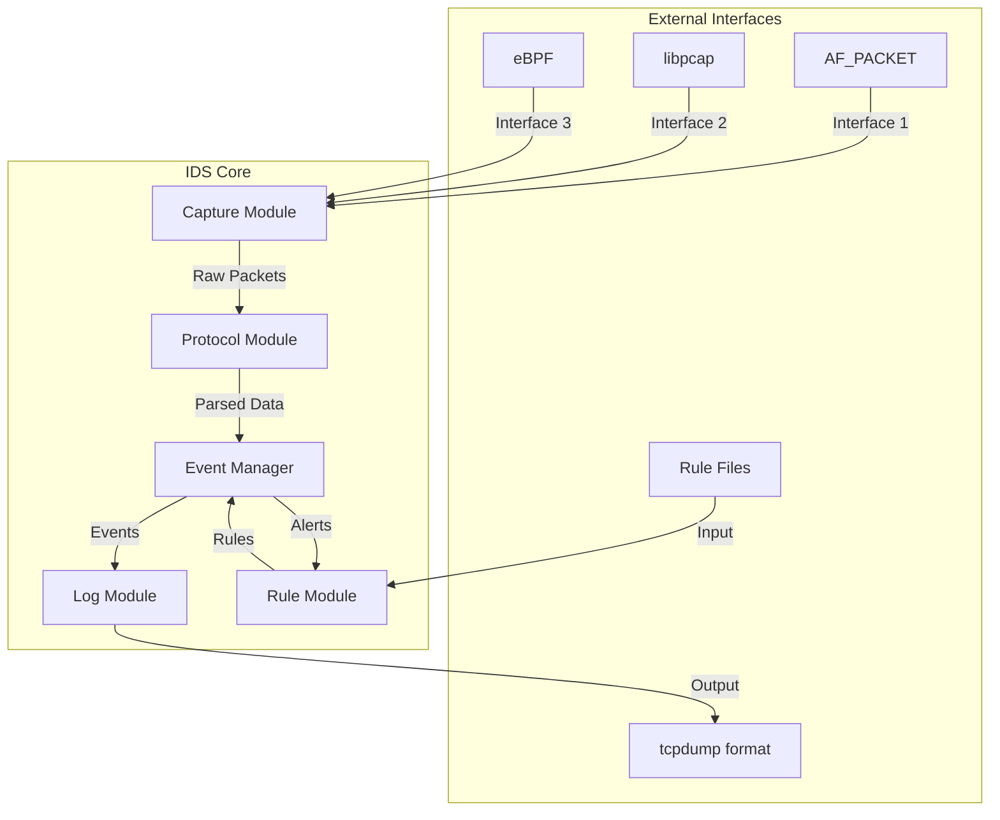
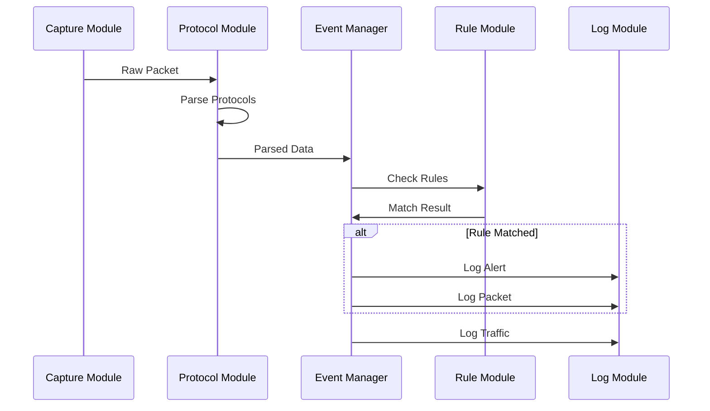

# IDS Architecture Design

## Overview
IDS is a minimal Intrusion Detection System designed with modular architecture to support traffic capture, protocol parsing, logging, and rule-based detection.

## System Architecture



## Module Design

### 1. Traffic Capture Module
**Purpose**: Capture network packets from various sources

**Key Components**:
- Abstract capture interface
- AF_PACKET implementation (primary)
- libpcap wrapper (future extension)
- eBPF integration (future extension)

**Interface Design**:
```cpp
class ICaptureModule {
public:
    virtual bool initialize(const CaptureConfig& config) = 0;
    virtual Packet* capturePacket() = 0;
    virtual void shutdown() = 0;
    virtual ~ICaptureModule() = default;
};
```

### 2. Protocol Parsing Module
**Purpose**: Parse network protocols in layered architecture

**Protocol Layers** (TCP/IP model):
- Link Layer: Ethernet, ARP
- Internet Layer: IP, ICMP
- Transport Layer: TCP, UDP
- Application Layer: HTTP, DNS (basic)

The protocol parsing follows a strict layered approach where each layer is parsed independently:

1. **Link Layer Parsing** (Ethernet):
   - Parse Ethernet frame header
   - Identify EtherType to determine next layer protocol
   - Extract source and destination MAC addresses

2. **Network Layer Parsing** (IP):
   - Parse IP header based on EtherType
   - Handle IPv4 and IPv6 separately
   - Extract source and destination IP addresses
   - Identify transport layer protocol (TCP/UDP/ICMP)

3. **Transport Layer Parsing** (TCP/UDP):
   - Parse TCP or UDP header based on IP protocol field
   - Extract source and destination ports
   - Handle protocol-specific fields (TCP flags, sequence numbers, etc.)

4. **Application Layer Parsing** (Optional):
   - Parse application layer data when available
   - Handle protocol-specific parsing (HTTP headers, DNS records, etc.)

**Plugin Architecture**:
```cpp
class IProtocolPlugin {
public:
    virtual bool canParse(const Packet& packet) = 0;
    virtual ProtocolData* parse(const Packet& packet) = 0;
    virtual std::string getName() const = 0;
    virtual ~IProtocolPlugin() = default;
};
```

### 3. Logging Module
**Purpose**: Log events and packet information in tcpdump-compatible format

**Features**:
- tcpdump-style packet output
- Configurable log levels
- Multiple output formats (console, file)
- Packet content preservation

**Log Format**:
```
[timestamp] [level] [protocol] [src_ip:src_port] -> [dst_ip:dst_port] [flags] [packet_size]
[hex_dump_of_packet]
```

### 4. Rule Engine Module
**Purpose**: Parse and match detection rules

**Rule Format** (Snort-like syntax):
```
alert [protocol] [src_ip] [src_port] -> [dst_ip] [dst_port] [rule_options]
```

**Rule Components**:
- Rule parser
- Rule matcher
- Action executor
- Rule management

## Data Flow



## Plugin System Design

### Protocol Plugin Interface
```cpp
class IProtocolPlugin {
public:
    virtual bool initialize() = 0;
    virtual bool canParse(const Packet& packet, int layer) = 0;
    virtual ProtocolData* parse(const Packet& packet, int offset) = 0;
    virtual int getPriority() const = 0;
    virtual std::string getName() const = 0;
    virtual ~IProtocolPlugin() = default;
};
```

### Plugin Manager
- Dynamic plugin loading
- Plugin registration
- Priority-based parsing
- Plugin lifecycle management

## Configuration System

### Main Configuration
```yaml
ids:
  capture:
    interface: "eth0"
    buffer_size: 65536
    timeout: 1000
    
  logging:
    level: "INFO"
    format: "tcpdump"
    output: "console"
    file_path: "/var/log/ids.log"
    
  rules:
    rule_files:

  protocols:
    enabled:
      - "ethernet"
      - "ipv4"
      - "tcp"
      - "udp"
      - "icmp"
```

## Build System

### CMake Structure
```
ids/
├── CMakeLists.txt
├── src/
│   ├── core/
│   ├── capture/
│   ├── protocol/
│   ├── log/
│   ├── rule/
│   └── main.cpp
├── include/
│   └── ids/
├── plugins/
│   └── protocols/
├── tests/
├── docs/
└── config/
```

### Dependencies
- CMake 3.10+
- C++17 compiler
- Linux kernel headers (for AF_PACKET)
- pthread library
- Optional: libpcap-dev, libbpf-dev

## Security Considerations

1. **Privilege Management**: Requires root privileges for packet capture
2. **Memory Safety**: Careful buffer management for packet data
3. **Rule Validation**: Input validation for rule parsing
4. **Resource Limits**: Prevent resource exhaustion attacks
5. **Log Security**: Secure log file handling

## Performance Optimization

1. **Zero-copy**: Minimize packet data copying
2. **Batch Processing**: Process multiple packets together
3. **Lock-free**: Use lock-free data structures where possible
4. **Memory Pool**: Pre-allocate memory for packet data
5. **CPU Affinity**: Pin threads to specific CPU cores

## Extensibility Points

1. **New Capture Methods**: Add support for DPDK, netmap
2. **New Protocols**: Plugin system for protocol parsers
3. **New Rule Types**: Extensible rule engine
4. **New Outputs**: Multiple logging backends
5. **New Actions**: Flexible response mechanisms

## Testing Strategy

1. **Unit Tests**: Individual module testing
2. **Integration Tests**: Module interaction testing
3. **Performance Tests**: Throughput and latency testing
4. **Security Tests**: Input validation and boundary testing
5. **Rule Tests**: Rule matching accuracy testing