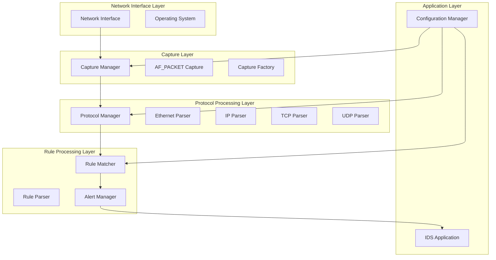
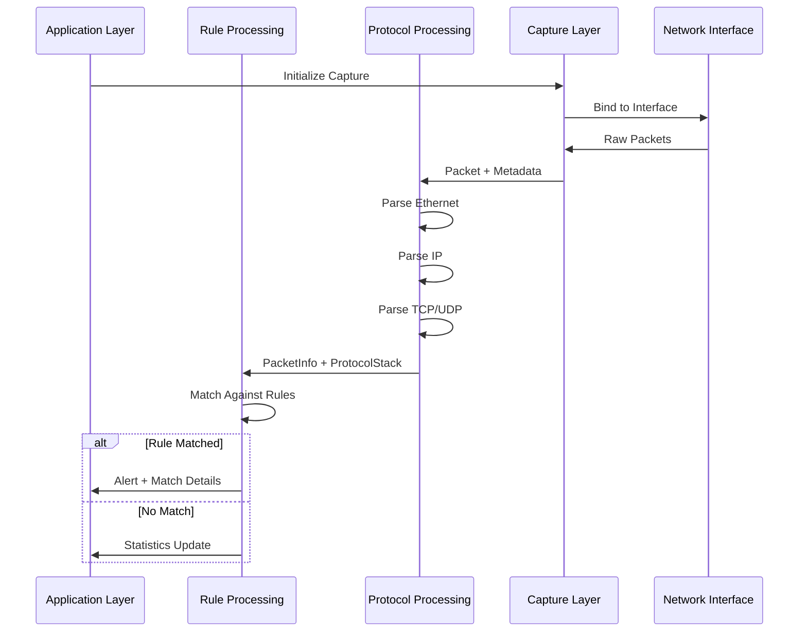

# Layered Architecture Design for Packet Analyzer System

## System Overview

This document presents a comprehensive layered architecture design for the packet analyzer system, following the principle of separation of concerns from network traffic capture to rule matching and alerting.

## Architecture Layers



## Layer 1: Network Interface Layer

**Purpose**: Interface with physical/virtual network hardware and OS networking stack

**Components**:
- Network Interface Cards (NIC)
- Operating System networking stack
- Driver interfaces

**Responsibilities**:
- Raw packet reception from network hardware
- Interface configuration and management
- Hardware-level packet filtering capabilities

## Layer 2: Capture Layer

**Purpose**: Capture raw network packets from specified interfaces

**Key Interfaces**:
```cpp
class ICaptureModule {
public:
    virtual bool initialize(const CaptureConfig& config) = 0;
    virtual std::unique_ptr<Packet> capturePacket() = 0;
    virtual void shutdown() = 0;
    virtual ~ICaptureModule() = default;
};

class CaptureManager {
public:
    bool initialize(const Config& config);
    void startCapture();
    void stopCapture();
    std::unique_ptr<Packet> getNextPacket();
};
```

**Components**:
- `AFPacketCapture`: Primary capture implementation using AF_PACKET
- `CaptureFactory`: Factory for creating capture modules
- `CaptureManager`: Orchestrates capture operations and buffer management

**Data Flow**:
- Raw binary packets from network interface
- Packet metadata (timestamps, interface info)
- Error handling for capture failures

## Layer 3: Protocol Processing Layer

**Purpose**: Parse and identify network protocols in layered fashion

**Key Interfaces**:
```cpp
class IProtocolParser {
public:
    virtual ProtocolType getProtocolType() const = 0;
    virtual bool canParse(const Packet& packet) const = 0;
    virtual ParsingResult parse(const Packet& packet) const = 0;
    virtual ~IProtocolParser() = default;
};

class ProtocolManager {
public:
    bool initialize(const Config& config);
    ProtocolStack parsePacket(const Packet& packet);
    void registerParser(std::unique_ptr<IProtocolParser> parser);
};
```

**Components**:
- `EthernetParser`: Link layer protocol parsing
- `IPParser`: Network layer IPv4/IPv6 parsing
- `TCPParser`: Transport layer TCP parsing
- `UDPParser`: Transport layer UDP parsing
- `ProtocolManager`: Orchestrates layered parsing

**Data Structures**:
```cpp
struct ProtocolStack {
    std::optional<EthernetInfo> ethernet;
    std::optional<IPInfo> ip;
    std::optional<TCPInfo> tcp;
    std::optional<UDPInfo> udp;
    std::vector<ProtocolFinding> findings;
};

struct PacketInfo {
    std::string src_ip;
    std::string dst_ip;
    uint16_t src_port;
    uint16_t dst_port;
    RuleProtocol protocol;
    const Packet* raw_packet;
    ProtocolStack protocol_stack;
};
```

## Layer 4: Rule Processing Layer

**Purpose**: Match parsed packet information against detection rules

**Key Interfaces**:
```cpp
class IRuleMatcher {
public:
    virtual bool initialize(const Config& config) = 0;
    virtual std::vector<RuleMatch> matchPacket(const PacketInfo& packet_info) = 0;
    virtual void addRules(const std::vector<Rule>& rules) = 0;
    virtual ~IRuleMatcher() = default;
};

class AlertManager {
public:
    void handleAlert(const RuleMatch& match, const PacketInfo& packet_info);
    void logEvent(const std::string& message, LogLevel level);
};
```

**Components**:
- `RuleParser`: Parses rule files and creates Rule objects
- `EnhancedRuleMatcher`: Performs actual rule matching against packet data
- `AlertManager`: Handles alert generation and logging
- `ThresholdManager`: Manages rule threshold conditions

**Data Structures**:
```cpp
struct RuleMatch {
    const Rule* rule;
    std::string message;
    uint32_t sid;
    uint32_t rev;
    std::string classtype;
    std::unordered_map<std::string, std::string> matched_content;
    std::chrono::system_clock::time_point timestamp;
};
```

## Layer 5: Application Layer

**Purpose**: Main application coordination and user interface

**Key Interfaces**:
```cpp
class IDSApplication {
public:
    bool initialize(const std::string& config_path);
    void run();
    void shutdown();
    void reloadConfiguration();
    SystemStats getStatistics() const;
};
```

**Components**:
- `IDSApplication`: Main application controller
- `ConfigurationManager`: Centralized configuration management
- `StatisticsCollector`: Performance and operation statistics
- `SignalHandler`: System signal handling

## Data Flow Between Layers



## Configuration Management

**Centralized Configuration Structure**:
```yaml
ids:
  capture:
    interface: "eth0"
    buffer_size: 65536
    timeout_ms: 1000
    promiscuous: true
    
  protocols:
    enabled:
      - "ethernet"
      - "ipv4"
      - "tcp"
      - "udp"
    parsing_depth: "full"
    
  rules:
    rule_files:
      - "config/rules/local.rules"
      - "config/rules/emerging.rules"
    auto_reload: true
    reload_interval: 300
    
  alerts:
    log_level: "INFO"
    output: "console"
    file_path: "/var/log/ids/alerts.log"
```

## Error Handling Strategy

**Layer-Specific Error Handling**:
- **Capture Layer**: Network interface errors, permission issues
- **Protocol Layer**: Malformed packets, parsing errors
- **Rule Layer**: Invalid rule syntax, matching errors
- **Application Layer**: Configuration errors, system resource issues

**Error Propagation**:
- Each layer handles recoverable errors internally
- Critical errors propagate upward with context
- Error logging at appropriate severity levels

## Performance Considerations

**Memory Management**:
- Zero-copy packet processing where possible
- Object pooling for frequent allocations
- Efficient data structure design

**Processing Optimization**:
- Batch processing for rule matching
- Pre-compiled rule patterns
- Connection state caching
- Efficient protocol parsing algorithms

## Extensibility Points

**New Capture Methods**:
- Implement additional `ICaptureModule` implementations
- Support for DPDK, netmap, etc.

**New Protocol Parsers**:
- Implement `IProtocolParser` for new protocols
- Dynamic plugin loading

**New Rule Types**:
- Extensible rule matching engine
- Custom rule actions and conditions

## Security Considerations

**Privilege Separation**:
- Minimal required privileges for each layer
- Secure configuration file handling
- Input validation at layer boundaries

**Resource Protection**:
- Memory usage limits
- CPU utilization monitoring
- File descriptor limits

This layered architecture provides clear separation of concerns, modular design for extensibility, and efficient data flow from network capture to rule-based detection.