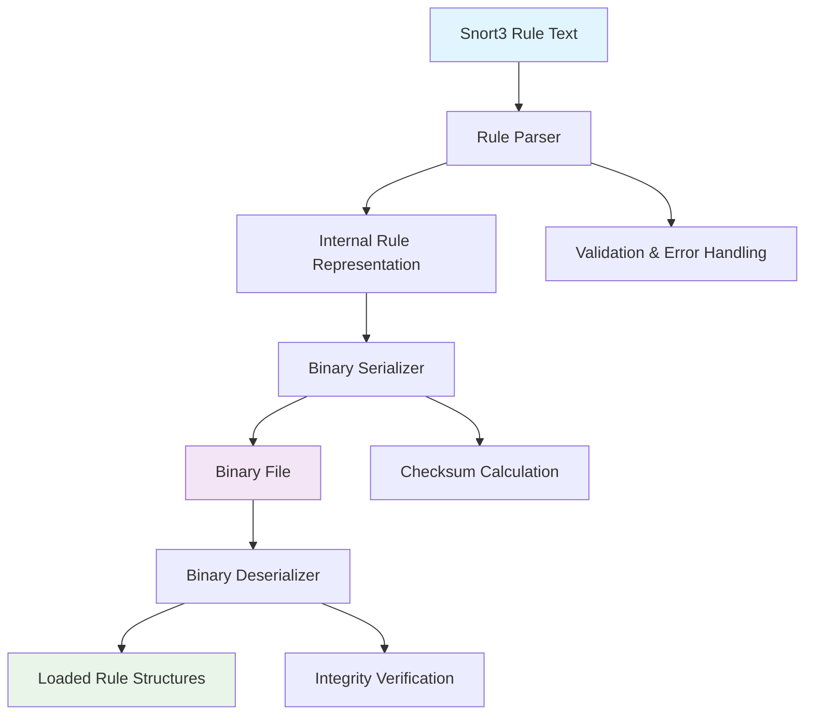

# Snort3 Rule to Binary Translator - Architecture Plan

## Overview
A C++ tool to convert Snort3 rules into a binary format for efficient loading and execution. The binary file consists of a file header and serialized rule data.

## Snort3 Rule Syntax Support (MVP)

### Supported Actions
- `alert` - Generate an alert
- `log` - Log the packet
- `pass` - Ignore the packet
- `drop` - Drop the packet

### Supported Protocols
- `tcp` - TCP protocol
- `udp` - UDP protocol  
- `icmp` - ICMP protocol

### Supported Rule Options
- `content` - Pattern matching content
- `msg` - Rule message description
- `sid` - Rule ID (numeric)
- `rev` - Revision number (numeric)
- `classtype` - Classification type
- `priority` - Priority level (numeric)
- `metadata` - Key-value metadata
- `flow` - Session flow direction
- `flags` - TCP flags matching

## Binary File Format Specification

### File Header Structure
```
Offset | Size | Field        | Description
-------|------|--------------|-------------
0x00   | 4    | magic        | Magic number: 0x534E5254 ("SNRT")
0x04   | 4    | version      | File format version (1.0)
0x08   | 8    | timestamp    | Creation time (Unix timestamp)
0x10   | 4    | rule_count   | Number of rules in file
0x14   | 4    | header_size  | Total header size in bytes
0x18   | 4    | data_size    | Total rules data size in bytes
0x1C   | 4    | checksum     | CRC32 checksum of rules data
```

### Rule Data Structure
Each rule is serialized with the following format:
- Rule header (fixed size)
- Variable-length options array
- String data (length-prefixed)

## C++ Data Structures

### File Header
```cpp
struct FileHeader {
    uint32_t magic;        // 0x534E5254
    uint32_t version;      // Format version
    uint64_t timestamp;    // Creation time
    uint32_t rule_count;   // Number of rules
    uint32_t header_size;  // Size of this header
    uint32_t data_size;    // Size of rules data
    uint32_t checksum;     // CRC32 checksum
};
```

### Rule Structures
```cpp
enum class Action : uint8_t { ALERT, LOG, PASS, DROP };
enum class Protocol : uint8_t { TCP, UDP, ICMP, IP };
enum class Direction : uint8_t { UNI, BI };

struct RuleHeader {
    Action action;
    Protocol protocol;
    char src_ip[16];       // IPv4/IPv6 as string
    char dst_ip[16];
    uint16_t src_port;
    uint16_t dst_port;
    Direction direction;
    uint32_t option_count; // Number of options
};

struct RuleOption {
    uint32_t type;         // Option type ID
    uint32_t value_len;    // Length of value data
    // Followed by value data (variable length)
};

struct Rule {
    RuleHeader header;
    std::vector<RuleOption> options;
    std::vector<std::string> strings; // String data pool
};
```

## System Architecture



## Module Design

### 1. Rule Parser Module
- **Input**: Snort3 rule text
- **Output**: Structured Rule objects
- **Components**:
  - Tokenizer for rule decomposition
  - Syntax validator
  - Semantic analyzer

### 2. Binary Serializer Module  
- **Input**: Rule objects
- **Output**: Binary file stream
- **Components**:
  - Structure-to-binary converter
  - String pool manager
  - Checksum calculator

### 3. Binary Deserializer Module
- **Input**: Binary file
- **Output**: Rule objects
- **Components**:
  - File format validator
  - Binary-to-structure converter
  - Integrity verifier

## Project Structure
```
rule2bin/
├── include/
│   ├── rule_parser.h
│   ├── binary_serializer.h
│   ├── binary_deserializer.h
│   └── structures.h
├── src/
│   ├── main.cpp
│   ├── rule_parser.cpp
│   ├── binary_serializer.cpp
│   └── binary_deserializer.cpp
├── tests/
│   ├── test_parser.cpp
│   ├── test_serializer.cpp
│   └── integration_test.cpp
├── CMakeLists.txt
└── README.md
```

## Dependencies
- C++17 standard library
- CMake 3.10+ (build system)
- Google Test (for unit testing, optional)

## Implementation Phases

### Phase 1: Core Infrastructure
- Project setup with CMake
- Basic data structures
- File I/O utilities

### Phase 2: Rule Parsing
- Snort3 rule parser implementation
- Syntax validation
- Unit tests

### Phase 3: Binary Serialization
- Binary format implementation
- Serialization logic
- Checksum calculation

### Phase 4: Binary Deserialization
- File loading and validation
- Structure reconstruction
- Integrity verification

### Phase 5: Testing & Documentation
- Comprehensive unit tests
- Integration tests
- API documentation
- Usage examples